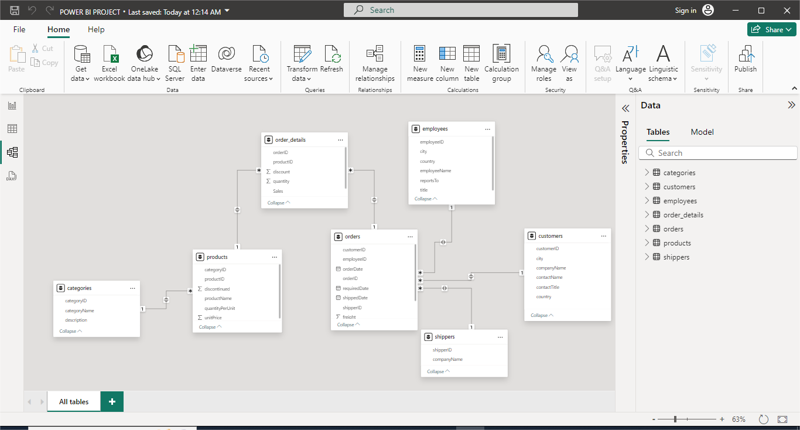

# NORTHWIND-TRADER-SALES-ANALYSIS

## INTRODUCTION
This is a Power Bi project on **Northwind Trader Analysis**. The project is to analyze and derive insights to answer  questions and help simplify the data and give good understanding.

**_DISCLAIMER_**: _ALL datasets and reports do not represent any company, institution or country, but just a dummy dataset to show my understanding of PowerBi_

## PROBLEM STATEMENT
1. Top 3 Products ordered in high quantity
2. Total number of orders placed by each companies
3. The rate of need of a products across all countries
4. Top 10 products being ordered across the years
5. Total Transactions made across the years
6. Total number of products sales closed by each employee
7. Top 5 sales generating companies
8. Countries with the highest and lowest sales outcome
9. Total sales made monthly across all years 

## SKILLS/ CONCEPTS DEMONSTRATED 
- Modelling
- Quick measure
- Page navigation
- Filters

## MODELLING
An automatic relationship was derived by Power BI but i replaced it with the relationship i wanted in order to carry out my analysis

  
